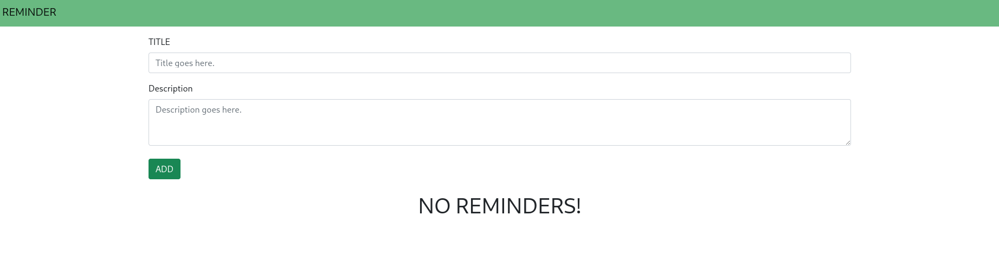
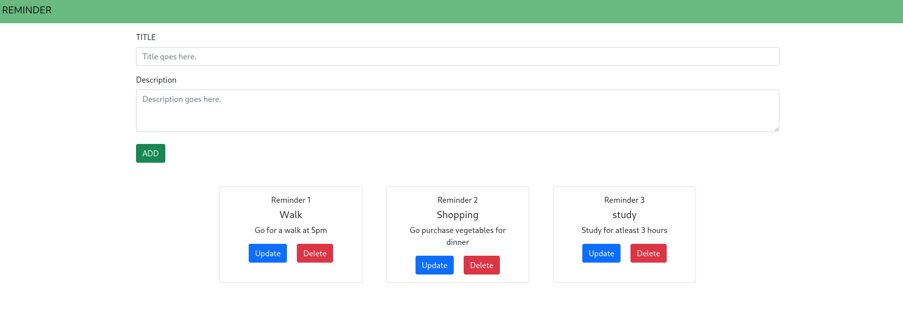

## Reminder webapp

> A reminder/note taking app using python's Flask library

**Usage**

```
git clone https://github.com/glowfi/reminder
cd reminder
source ./flsk/bin/{YOUR-PREFERED_SHELL}
pip install flask-sqlalchemy
flask run
```

**Features**

-   Update Reminders
-   Create Reminders
-   Delete Reminders
-   Bonus : Can be used as a note taking app also

### DEMO



